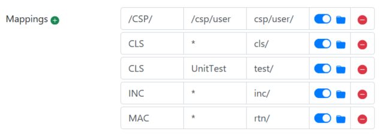

# git-source-control
Embedded Git support for InterSystems platforms, supporting unified source control for changes made via IDEs (e.g., VSCode over isfs) and the Management Portal (Interoperability and Business Intelligence).

## Prerequisites/Dependencies

* IRIS instance with license key
* Git 2.31.0+
* OpenSSH 7.6+
* InterSystems package manager (https://openexchange.intersystems.com/package/ObjectScript-Package-Manager)

## Installation and Setup

1. Load this repository into IRIS from the community package registry.
    ```
    zpm "install git-source-control"
    ```
    To install on an environment without access to the internet, download the tar.gz file from the [releases](https://github.com/intersystems/git-source-control/releases) page. Copy the archive onto a file system the IRIS instance has access to and extract it. Use the package manager to load the release from that directory.
    ```
    tar -xf /path/to/archive/git-source-control-release.tar.gz
    zpm "load /path/to/archive/git-source-control-release"
    ```
2. Configure settings by running the following method and answering the prompts:
   ```
   d ##class(SourceControl.Git.API).Configure()
   ```
   This will also allow you to generate an SSH key for use as (e.g.) a deploy key and to initialize or clone a git repo. (If you want to use https instead, please see the documentation [here])(/docs/https.md)
3. If using VSCode: Set up `isfs` server-side editing. First, save your current workspace in which you have the code open. Then, open the `.code-workspace` file generated by VS Code and add the following to the list of folders:
    ```
    {
        "name": "<whatever you want the folder to show up as in the project explorer view>",
        "uri": "isfs://<instance_name>:<namespace_name>/"
    }
    ```

### Making available instance-wide via %ALL namespace

To make git-source-control available to all namespaces on an instance without manually installing it in each, you can run:

`do ##class(SourceControl.Git.API).MapEverywhere()`

This will create the appropriate mappings to have all namespaces on the system use the version in the current namespace. Note, namespaces still must be configured independently. To undo this, you can delete the mappings from the %ALL namespace.

## Basic Use

The point of Embedded Git is to intercept events made through all editors - both IDEs and the management portal - so that changes are reflected in the filesystem, in a git repo, and able to be shared with others. There are also source-control specific menus to help you do key tasks.

### Source Control

For those with less experience using source control, we recommend this [page](/docs/scintro.md) for a quick introduction to source control / change control basics.

### Health Connect Cloud

git-source control is the recommended source control for Health Connect Cloud. [This page](/docs/hcc.md) covers HCC specific usage of git-source-control, including the recommended development workflow, initial setup, and CI/CD pipelining.

### VSCode

Source control menus will appear under "Server Source Control..." when right-clicking in a file (in the editor) or on a file when exploring an isfs folder. The top level "source control" menu is accessible through the command palette or the source control icon near the top right of the editor.


For full details on all of the menu items, see [this reference page](/docs/menu-items.md).

### Management Portal Editors

In relevant editors in the management portal, there are two icons that allow access to the same source control functionality as in IDEs. Click the source control icon to see the menu, and the clipboard to see output from previously run commands in your browser session.

*Important*: if using source control for interoperability, check the "Permit Enabling Automatic Refresh of Management Portal Pages" box in the management portal, at the page: Interoperability > Manage > Configuration > Interoperability Settings. This mitigates a potential for lost work.

### Studio

Note: Studio has been deprecated. VSCode is the IDE recommended by InterSystems.

That said, the same menu items and editor behavior will also work in Studio. There is a top-level "Git" menu with access to various operations and pages dependent on the current editor context.

## Notes

### Menu Options
Documentation for the various git-source-control menu options can be found [here](/docs/menu-items.md).

### Mapping Configuration
To specify where files should go relative to your repository root, add mappings via the "Settings" menu item. A mapping has three parts:
* The file extension to use: e.g., CLS, MAC. As a special case for web application files, use "/CSP/" as the mapping.
* A filter on the files of that type (e.g., a package name or web application folder)
* The folder relative to the repo root that contains the item. This controls behavior for import and export. The keyword `<env>` will be expanded into the environment name to support different mapping configurations, for example for system default settings.

This might look like:



Additional documentation on file types [can be found here](https://docs.intersystems.com/services/csp/docbook/DocBook.UI.Page.cls?KEY=AGITLAB#AGITLAB_settings_mappings).

### Baselining Source Code
If enabling source control on an existing system, you will need to create a baseline by exporting all existing items to the Git repository. See [our documentation on baselining](/docs/baselining.md).

### Pull Event Handlers

The class `SourceControl.Git.PullEventHandler` is a base class that can be extended in order to develop functionality that should be run when the repository pulls from remote. The code placed inside the subclass' OnPull() method will be executed any time a pull occurs.

A recommended way to implement CI/CD would be to use one of the pre-defined subclasses of PullEventHandler that are placed inside the PullEventHandler package. Additionally, custom load logic can be placed in that package following the model of the existing subclasses.

### Use in Deployment

To manually pull the latest code from the current configured branch into an IRIS instance, use the "Git Pull" favorite link that is added to the management portal automatically on installation or via the Settings page "Favorite Namespaces" option.

To use git-source-control as part of automated deployment to a test/production environment with a running IRIS instance, the best approach is to call into the appropriate IRIS namespace to run:

`do ##class(SourceControl.Git.API).Pull(1)`

This is convenient for scripting because it will terminate with an OS-level error if anything goes wrong. Further automation and customization can live in your pull event handler, described above.

[This Developer Community answer](https://community.intersystems.com/post/cache-unit-test-jenkins#comment-115146) has some helpful guidance on how to call in to IRIS from the OS level for CI/CD; there are other helpful resources on the Developer Community as well.

### Security

#### Unsecured (http) connections
You really should be connecting to IRIS over a secured (https) connection. If you're not, web pages in this extension will launch in an external browser, because constraints around session cookies keep them from working properly in VSCode.

#### Dubious Ownership
Newer git versions may produce output like:
```
fatal: detected dubious ownership in repository at 'C:/Your/Repo/Root'
To add an exception for this directory, call:

   git config --global --add safe.directory C:/Your/Repo/Root

Set the environment variable GIT_TEST_DEBUG_UNSAFE_DIRECTORIES=true and run
again for more information.
```
It is important for the namespace temp folder to be owned by the user IRIS runs as. (On Unix, commonly irisusr; on Windows, generally a designated service account or SYSTEM.) Setting this config flag is unlikely to actually help; just make sure the ownership is correct.

#### Interacting with Remotes
If you want to interact with remotes from VSCode/Studio directly (e.g., to push/pull), you must use ssh (rather than https), create a public/private key pair to identify the instance (not yourself), configure the private key file for use in Settings, and configure the public key as a deploy key in the remote(s).

#### IRIS Privileges
For developers to be able to run this extension, they'll need the following privileges:
- the USE privilege on %System_Callout

### Setting up multiple GitHub deploy keys on one machine

Assuming you have the local and remote repositories created,

1. Create your key pair using `ssh-keygen`.
2. Add the public key to GitHub.
3. You can try setting remotes with the URL your remote repository provides, but sometimes your firewall might cause issues and refuse the SSH connection. In that case, I've found that changing the remote URL to the following is helpful:
   `ssh://git@ssh.github.com:443/<repo_owner>/<repo_name>.git`
4. Copy the private key into 2 locations
   1. `<path to IRIS Instance storage>\mgr\<private key>`
   2. `~/.ssh/<private key>`
5. Make sure to set the owner and permissions for the private key correctly. For Windows, go to where the private key is stored in IRIS and edit the owner to be the admin, disable inheritance and remove all access to the key to every user except the admin.
6. In git source control settings, set the path to the private key as the one in IRIS.
7. Change the default `ssh` command in the git config for **your repository** as:
   `git config core.sshCommand 'ssh -i ~/.ssh/<private key name>'`
8. Test the refresh button for the remote branches on the WebUI, fetch from the source control menu in Studio or VS Code, and `git fetch` in Git Bash. All 3 should work without any issues.

### HTTPS Support
We recommend that people connect to their remote git repository using SSH. If you cannot use SSH connections, we also have support for HTTPS connection through OAuth2. See [our documentation for setting up an https connection](/docs/https.md).

## Support

If you find a bug or would like to request an enhancement, [report an issue](https://github.com/intersystems/git-source-control/issues/new). If you have a question, post it on the [InterSystems Developer Community](https://community.intersystems.com/) - consider using the "Git" and "Source Control" tags as appropriate.

## Contributing

Please read [contributing](CONTRIBUTING.md) for details on the process for submitting pull requests to us.

### During Development

:warning: Whenever any code in this project is updated outside the server (e.g. after every `git pull`), you _have_ to run `zpm "load <absolute path to git-source-control>"`. Otherwise, the changes won't be reflected on the server. However, if you load git-source-control via the InterSystems package manager and run `git pull` via the extension itself with the default pull event handler configured, it'll just work.
