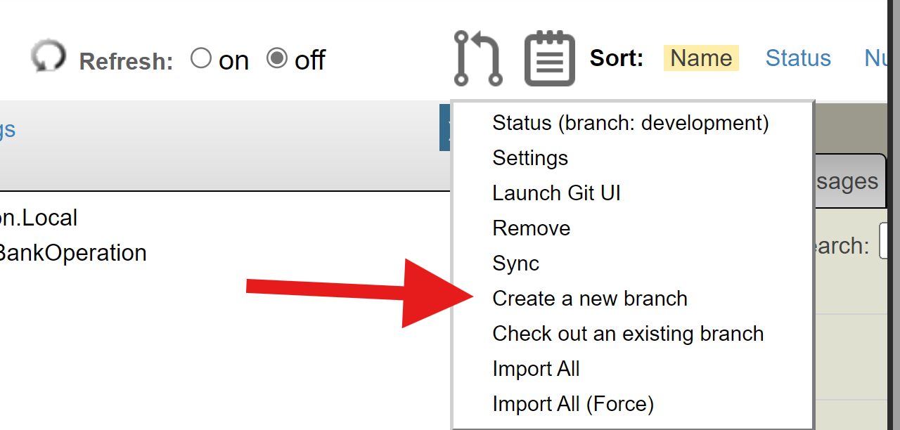

# git-source-control for Health Connect Cloud Overview

## Development Workflow

git-source-control has two main use modes: Basic and Expert. For Health Connect Cloud, we recommend beginning with Basic Mode, since it includes all of the necessary functionality for proper source control development while being easy to use for those with less Git experience. The recommended workflow for Health Connect Cloud is to create interface branches, create merge requests into development, and then pull the changes into the main dev development namespace.

A Health Connect Cloud Dev deployment will have a main namespace (which is also present in Test and Prod) and should also have a dedicated namespace for each developer contributing. These namespaces can be configured via the Cloud Portal. It is important for changes to originate in developer-specific namespaces; the main namespace in the dev deployment should always be kept up to date with the development branch in GitLab, either through a CI/CD pipeline or by use of the Git Pull page from git-source-control.

### Interface Branches

The first step in making changes in Health Connect Cloud using git-source-control is making an interface (feature) branch. To start out, you should be in your own personal development namespace. In order for changes to be tracked by source control properly, each change (also called a feature) should be made on it's own branch, so as to not interfere with other changes, and allow for testing of its effects on the production environment. To create a new feature branch, use the source control menu and select "Create new branch".

You will be prompted to enter a name for your new branch (no spaces or special characters), after which your environment will switch to that new branch. All new branches are fresh copies of the development branch. We recommend that you name branches descriptively based on a reference to the issue/bug that you are trying to fix - a GitLab issue number, Jira, ServiceNow ticket reference, etc.

### Making Changes

Now that you are in your new branch (you can see your current branch in the first item in the source control menu), you can start making changes. As you make changes to different business processes, rules, and productions, make sure that all of these changes are saved properly and any new items are added to source control (via the "Add" menu item) before you continue to sync and merge.

### Syncing and Merge Requests

Once you have made all the changes for the specific feature you are working on, and have tested in your namespace, it will be time to merge all of these changes into the development branch.

To start, press the sync button from the source control menu. 

This will bring up the sync interface, where you are able to see all the of the files you have changed, as well as add a descriptive comment for the changes you made. When you sync, these changes will be pushed to the git remote.

Use the link in the output of the sync in order to create a merge request in the git remote (don't worry if you close out of the sync tab, you can also navigate to GitLab manually). Here, you should make sure that you are merging your interface branch into the development environment, and notify / add the relevant reviewers. Once this merge request is approved, it will be merged into the development branch, so that all of your changes will now be a part of development.

### Switching Branches

Suppose you begin working on a larger project in one branch, and then need to shift to something else. The proper approach to this in git-source-control is to commit your in-progress work on the first interface, and then to switch to a new branch. This branch will be based on the development branch and may be missing components from the first project, but that's OK. You can always switch back to the first interface branch to continue work there.

## Deploying Changes to the Main Dev Namespace

If you are using a CI/CD pipeline in GitLab, simply merging the feature branch to development is enough; your change will be deployed to the main development namespace automatically.

If you are not using a CI/CD pipeline, you can get merged changes into the main development namespace using the "Git Pull" link from the Favorites section in the Health Connect Cloud home page. This will load and compile the incremental set of changes from new commits to the development branch.

## Deploying Changes to Test and Prod

### Deploying using CI/CD Pipelines

With CI/CD pipelines in place, the most important thing is that there is a branch in GitLab that corresponds to the main namespace in Test and another that corresponds to the main namespace on Prod, so that you can see exactly when changes made it to each branch/environment. With CI/CD pipelines, there's no action needed to move the change forward - merging the merge request is sufficient. The recommended workflow for this is to create additional merge requests from the interface branch to each of Test and Prod. Other Git branching and change flows may be appropriate if you have a strong opinion about them.

### Deploying using the Deployment Manager

Another way to move work from the main Dev namespace to the corresponding namespace in Test and Prod environments is using the Deployment Manager to move from Dev to Test, then Test to Prod. This loses the traceability of a clean branch-to-environment mapping, but is perhaps simpler technically and involves less time wrangling merge requests in GitLab. For guidance on using the deployment manager, see [InterSystems Documentation](https://docs.intersystems.com/irisforhealthlatest/csp/docbook/Doc.View.cls?KEY=EGDV_deploying).