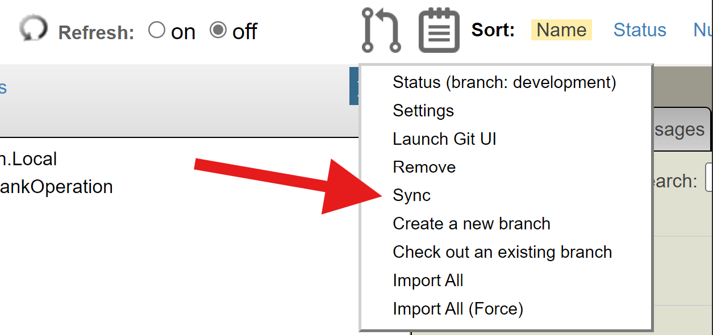
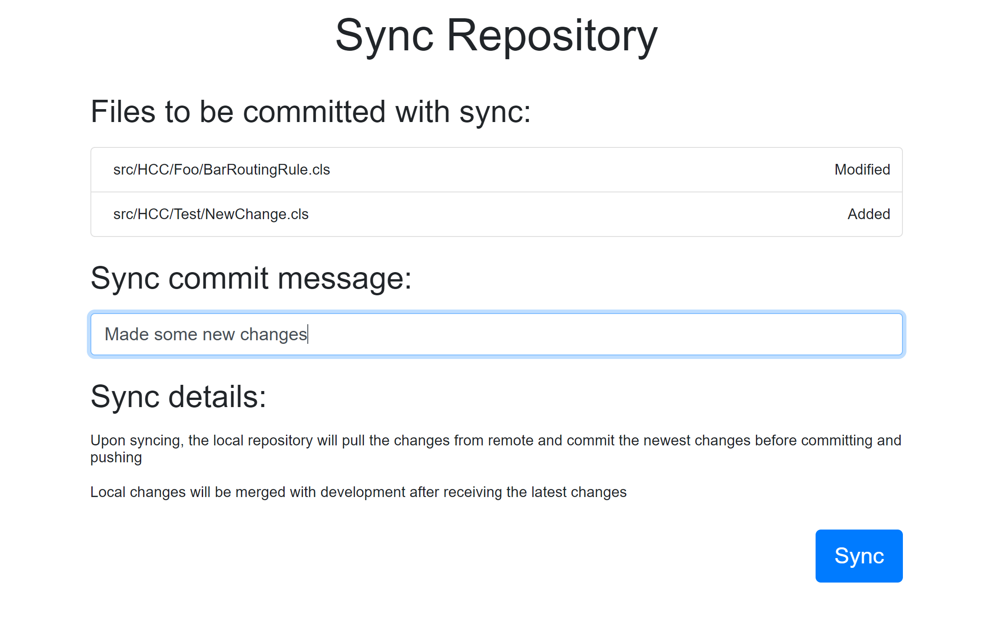

# git-source-control for Health Connect Cloud Overview

## Development Workflow

git-source-control has two main use modes: Basic and Expert. For Health Connect Cloud, we recommend beginning with basic mode, since it includes all of the necessary functionality for proper source control development while being easy to use for those with little development / source control experience. The recommended workflow for Health Connect Cloud is to create interface branches, create merge requests into development, and then pull the changes into the shared development namespace. The rest of this section explains this workflow more in depth for those with less source control experience. 

### Interface branches

The first step in making changes in Health Connect Cloud using git-source-control is making an interface (feature) branch. In order for changes to be tracked by source control properly, each change (also called a feature) should be made on it's own branch, so as to not interfere with other changes, and allow for testing of its effects on the production environment. To create a new feature branch, use the source control menu and select "Create new branch".

You will be prompted to enter a name for your new branch (no spaces or special characters), after which your environment will switch to that new branch. All new branches are fresh copies of the development branch.

### Making changes

Now that you are in your new branch (you can see which branch you are in in the source control menu), you can start making changes. As you make changes to different business processes, rules, and productions, make sure that all of these changes are saved properly before you try to sync and merge.

### Syncing and Merge Requests

Once you have made all the changes for the specific feature you are working on, and have tested in your namespace, it will be time to merge all of these changes into the development branch.

To start, press the sync button from the source control menu. 

This will bring up the sync interface, where you are able to see all the of the files you have changed, as well as add a descriptive comment for the changes you made. When you sync, these changes will be pushed to the git remote.

Use the link in the output of the sync in order to create a merge request in the git remote (don't worry if you close out of the sync tab, you can also navigate to GitLab manually). Here, you should make sure that you are merging your interface branch into the development environment, and notify / add the relevant reviewers. Once this merge request is approved, it will be merged into the development branch, so that all of your changes will now be a part of development.

### Pull

In for the changes in development to be reflected in your namespace, you should swicth to the development namespace from the GitUI, and then access the git pull page (from the favorites bar), and pull any changes. You should see the changes you made now reflected in your local namespace again. It is good practice to git pull every once in a while to make sure that your local development branch is up to date with all of the changes made to the remote development.

