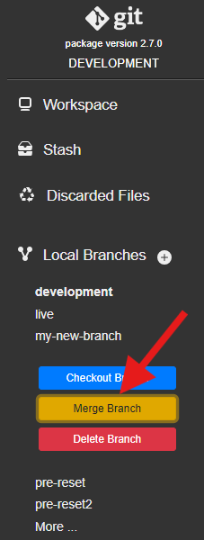

# git-source-control for Health Connect Cloud

## Development Workflow

git-source-control has two main use modes: Basic and Expert. For Health Connect Cloud, we recommend beginning with basic mode, since it includes all of the necessary functionality for proper source control development while being easy to use for those with little development / source control experience. The recommended workflow for HCC is to create featyre branches, merge them into development, and then git pull the changes in the shared development namespace. The rest of this section explains this workflow more in depth for those with less source control experience. 

### Feature branches

The first step in making changes in Health Connect Cloud using git-source-control is making a feature branch. In order for changes to be tracked by source control properly, each change (also called a feature) should be made on it's own branch, so as to not interfere with other changes, and allow for testing of its effects on the production environment. To create a new feature branch, navigate to the Git UI in the namespace you plan on doing development. 

First, make sure that you are in the development branch. It should be bolded and at the top of the Local Branches in the sidebar. If it is not, as pictured below, click on the "development" branch and press checkout branch.

Once you are in the development branch, press the "+" next the the Local Branches tab, and create a new branch by typing out a name for it. (No spaces or special characters are allowed in branch names).

Finally, you should click on the new branch you just made in the sidebar, and then press "Push".

This makes sure that your branch will be tracked in Gitlab, so that other users can checkout your branch to test your changes on their own namespaces.

After this, you can start working on the change.

### Merge Requests

Once you have made all the changes for the specific feature you are working on, and have tested in your namespace, it will be time to merge all of these changes into the development branch. To start, make sure that all your changes have been commited to your feature branch. To do this, navigate to the Git UI, and after making sure you are in the right feature branch, press the "Workspace" tab at the top of the sidebar. 

This will bring you to the workspace view. All the changes you made to files should be in the bottom left of the workspace view. 

Clicking on one of these files will bring up a line by line view of the changes that have been made. Make sure that these are the changes you want to make, and then select all the files. Next, enter a commit message that should describe that changes that have been made. 

You can enter more details below, and then press the commit button underneath. This will commit the changes you have made to your feature branch. Once all of your changes have been committed, you should be ready to merge into the development branch.

In the Git UI, first checkout the development branch, by selecting it from the Local Branches and pressing "Checkout branch". Next, find the feature branch that you have been working on, select it from the local branches, and press "Merge Branch". 

