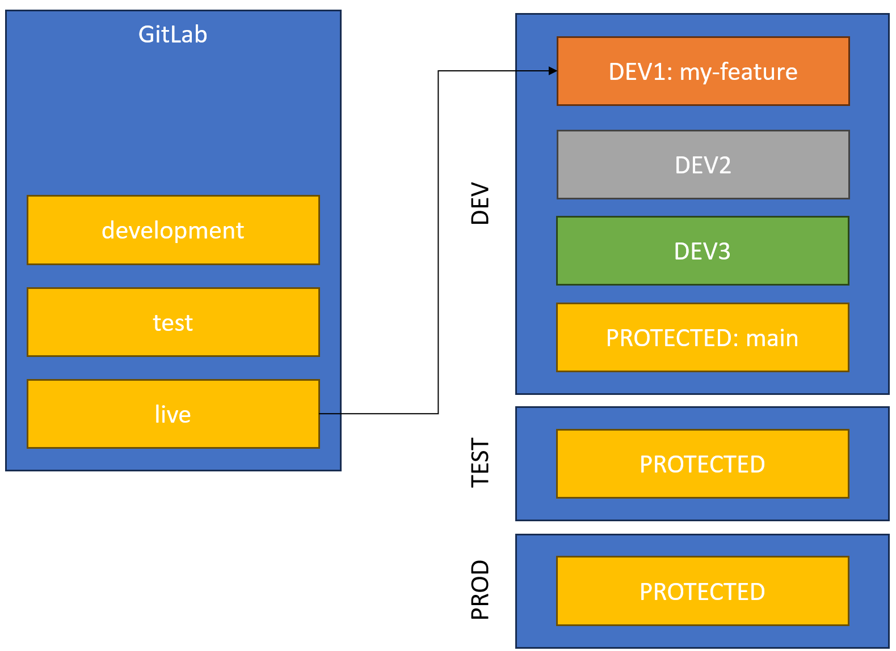
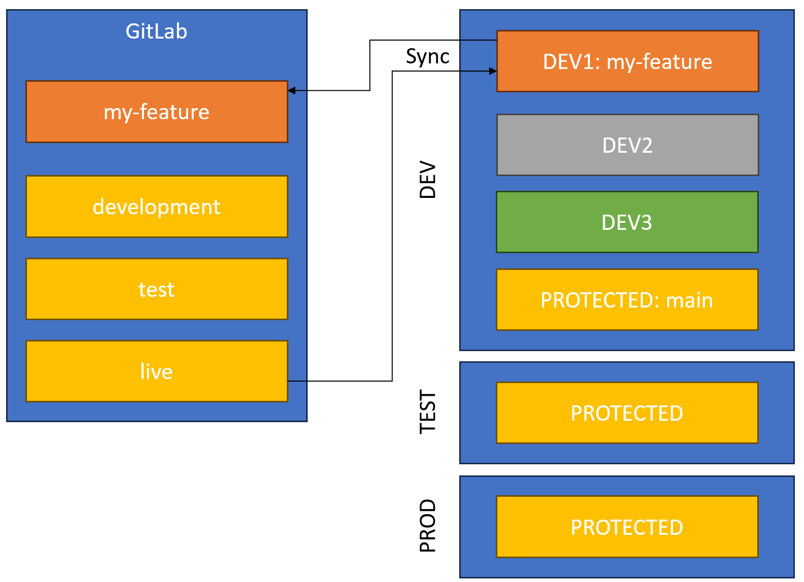
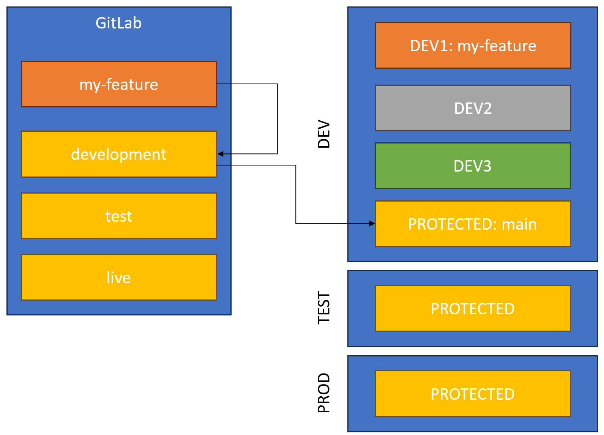
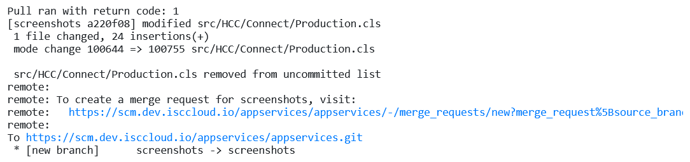
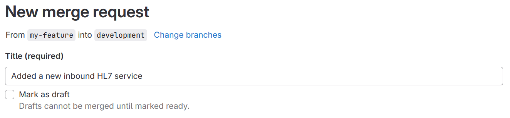
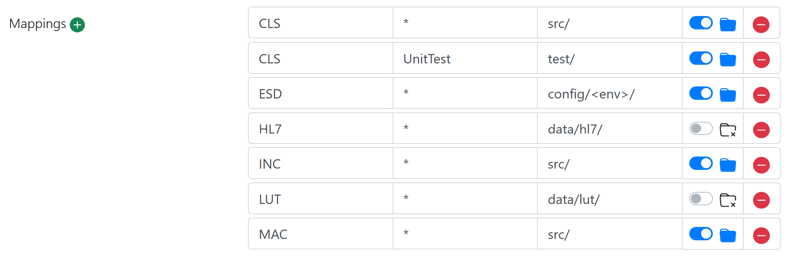
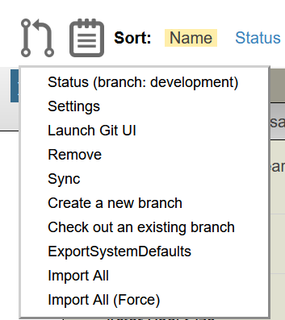

# Change Control with Embedded Git for Health Connect Cloud

## General 
The recommended workflow for Health Connect Cloud is to: create an interface branch, make changes, sync them to GitLab, create a merge request, review and approve the merge request, and then pull the changes into a protected namespace.

Step 1: Create an interface branch based on live

Step 2: Make changes in the User Namespace

Step 3: Sync to get latest from live and push to GitLab

Step 4: Merge request and repeat 2-3

A Health Connect Cloud Dev deployment will have at least one Protected Namespace and should also have a dedicated User Namespace for each user. These namespaces can be configured via the Cloud Portal for the selected Health Connect Cloud deployment. It is important for changes to originate in User Namespaces. Protected Namespaces in the Dev deployment are automatically kept up to date with the development branch of the associated GitLab repo through a CI/CD pipeline.

# Prerequisites: InterSystems Responsibilities
 - Create the GitLab repository for the organization
 - Grant appropriate access and privileges to the GitLab repository
 - Onboard customers on source control tools for Health Connect Cloud
 - Maintain change control documentation and videos
   - [Official Change Control Documentation](https://docs.intersystems.com)
   - [Learning Videos](https://learning.intersystems.com/course/view.php?name=HCCSourceControlUI)

# InterSystems-Recommended Workflow - Embedded Git and GitLab

## Notes on Customer Responsibilities
- Define policies for approving merge requests in GitLab.
- Decide on a mapping configuration that will define the locations of different item types in the Git repository.
- Onboard new developers to the Dev Deployment. This will involve creating new users, creating new User Namespaces, and configuring Git for those new namespaces.

## Example Use Case 1: Inbound HL7 Service
> As a Health Connect Cloud user, I want to add a new inbound HL7 service to receive HL7 messages from a lab.

- Log in
- Go to the production configuration page for your User Namespace
- Create an interface branch
- Add and test the service
- Sync: After this operation, the User Namespace has everything from the Prod Deployment in addition to changes made in the interface branch, and all of the modified files have been pushed to GitLab.
  - Technical level for the git-savvy: this commits to the interface branch locally, rebases the interface branch on the latest state of the live branch, updates the User Namespace with any changes made as a result, and force pushes the interface branch out to GitLab.
- Click the link to create a merge request targeting the `development` branch
- Have the merge request approved and merged to the `development` branch
- CI/CD deploys to the Protected Namespace on the Dev deployment
- Test in the Protected Namespace on the Dev Deployment
- Create a merge request from your interface branch to the `test` branch
- Have the merge request approved and merged to the `test` branch
- CI/CD deploys to the Protected Namespace on the Test deployment
- Test in the Protected Namespace on the Test deployment
- Create a merge request from your interface branch to the `live` branch
- Have the merge request approved and merged to the `live` branch
- CI/CD deploys to the Protected Namespace on the Prod deployment
- Done!

### Interface Branches

The first step in making changes in Health Connect Cloud using Embedded Git is making an interface (feature) branch. To start out, you should be in your own personal development namespace. In order for changes to be tracked by source control properly, each change (also called a feature) should be made on it's own branch, so as to not interfere with other changes, and allow for testing of its effects on the production environment. To create a new feature branch, use the source control menu and select "Create new branch".

You will be prompted to enter a name for your new branch (no spaces or special characters), after which your environment will switch to that new branch. All new branches are fresh copies of the live branch. We recommend that you name branches descriptively based on a reference to the issue/bug that you are trying to fix - a GitLab issue number, Jira, ServiceNow ticket reference, etc.

### Add and Test the Business Service

Now that you are in your new branch (you can see your current branch in the first item in the source control menu), you can start making changes. As you make changes to different business processes, rules, and productions, make sure that all of these changes are saved properly before you continue to sync and merge.

### Syncing

Once you have made all the changes for the specific feature you are working on, and have tested in your namespace, it will be time to merge all of these changes into the development branch.

To start, press the sync button from the source control menu. 

This will bring up the sync interface, where you are able to see a list of the files you have changed, as well as add a descriptive comment for the changes you made. When you sync, these changes will be pushed to GitLab.

### Merge Request Creation
Use the link in the output of the sync in order to create a merge request in the git remote (don't worry if you close out of the sync tab, you can also navigate to GitLab manually). Here, you should make sure that you are merging your interface branch into the development branch, and notify / add the relevant reviewers.

### Merge Request Approval and CI/CD deployment
Once this merge request is approved, it will be merged into the development branch, so that all of your changes will now be a part of development. After the changes are merged, a CI/CD pipeline will automatically deploy the changes to the protected namespace in the development deployment.

### Validate in Protected Namespace
Test your change in the protected namespace of the Dev Deployment to ensure that it works in the context of other developer's features that have been merged since you started the feature.

### Repeat in Test and Prod
In GitLab, create a new merge request from your interface branch to the test branch. Approve and merge the merge request. A CI/CD pipeline will automatically deploy the changes to the protected namespace in the Test Deployment so you may test them there. When ready to go live with the changes, create another new merge request from your interface branch to the live branch. Approve and merge it, and the changes will be automatically deployed to the Prod Deployment.

## Example Use Case 2: You Get Interrupted

### Switching Branches

Suppose you begin working on a larger project in one branch, and then need to shift to something else. The proper approach to this in Embedded Git is to commit your in-progress work on the first interface, and then to switch to a new branch. This branch will be based on the development branch and may be missing components from the first project, but that's OK. You can always switch back to the first interface branch to continue work there.

## Example Use Case 3: Onboarding a New User Namespace

### Configuring Git on a New Namespace

When creating a new namespace on the Health Connect instance, you will need to ensure that the Git configuration matches that in other namespaces. The steps to do so are:

- Configure the mappings in the settings. From the Settings page in the source control menu, view the Mappings configuration and confirm it matches the other namespaces. Below is a sample of a common mapping configuration.

- Configure the default merge branch. From the Settings page in the source control menu, the "Default merge branch" input should match that configured for other namespaces.

- Run "Import All (Force)" from the source control menu. This will populate the namespace with items from the Git repository.

## Deploying using CI/CD Pipelines

With CI/CD pipelines in place, the most important thing is that there is a branch in GitLab that corresponds to the protected namespace in Test and another that corresponds to the protected namespace on Prod, so that you can see exactly when changes made it to each branch/environment. With CI/CD pipelines, there's no action needed to move the change forward - merging the merge request is sufficient. The recommended workflow for this is to create additional merge requests from the interface branch to each of Test and Prod.

# Fallback Approach: VS Code and a Local Git Repository
Some users may prefer a client-side source control approach instead of Embedded Git. This requires an additional step of exporting items from the Health Connect Cloud deployment to a local Git repository using Visual Studio Code. It's important not to mix this approach with the Embedded Git approach. Mixing server-side and client-side source control in the same namespace can lead to major confusion.

# Example Use Case: Inbound HL7 Service (Local Git)
> As a Health Connect Cloud user, I want to add a new inbound HL7 service to receive HL7 messages from a lab.

### (*Optional*) Create an Issue
   - If necessary, create an issue in GitLab to describe the work to be done and document any requirements. This can help track progress and serve as a reference for the changes made.

### Create New Branch via GitLab
   - Navigate to the GitLab repository and create a new branch. This branch will serve as the workspace for your changes.
   - Branch naming should follow your team's conventions (e.g., `feature/issue-1234`).

### Perform Change in Health Connect Cloud
   - Make the necessary modifications in Health Connect Cloud according to your issue's requirements or planned changes.
   - Ensure that changes are tested and validated to avoid issues downstream.

### Export Change from Health Connect Cloud to VS Code
   - Export the updated components or files from Health Connect Cloud and open them in VS Code.
   - This ensures your local repository reflects the changes you made in the cloud environment.

### Review Changes in VS Code
   - Review the changes within VS Code to confirm they are accurate and meet the requirements outlined in the issue (if applicable).
   - Ensure the code adheres to coding standards and best practices.

### Add Commit Remarks
   - Add detailed commit remarks in VSCode to describe the changes. This helps other team members understand the purpose and details of the update.

### Commit Change in VSCode
   - Commit the reviewed and validated changes in VSCode. Use the commit message format that aligns with your team's guidelines.

### Sync Reviewed Changes in VSCode
   - Push the committed changes from VSCode to the corresponding branch in GitLab. This step synchronizes your local updates with the remote repository.

### Merge Changes in GitLab from Local Repository to Target Environment
   - After confirming that all necessary changes are pushed, prepare to merge from your feature branch to the target environment (e.g., development, test or production).

#### Create New Merge Request from Local to Target Environment
   - In GitLab, create a new Merge Request (MR) from your feature branch to the target environment.
   - Include relevant details in the MR description, such as the issue number, summary of changes, and any additional notes.
   - Assign reviewers or approvers as required.

#### Review and Approval
   - Wait for the required reviews and approvals before merging.
   - After the MR is approved, complete the merge to move the code to the target environment.

# Glossary
* User Namespace: a namespace dedicated for in-progress work by a particular Health Connect Cloud user.
* Protected Namespace: a namespace that exists with the same name in all deployments (Dev, Test, and Prod) in which the main interoperability production runs. Changes to protected namespaces are applied through CI/CD only.
* Deployment: a Health Connect Cloud instance accessible through the Cloud Portal. There is typically a Dev, Test, and Prod deployment for each organization.
* Dev Deployment: the Health Connect Cloud instance with a User Namespace for each user and one or more Protected Namespaces in which all development work originates
* Test Deployment: the Health Connect Cloud instance in which interoperability components are tested prior to deployment to Prod.
* Prod Deployment: the Health Connect Cloud instance serving actual production systems with interoperability.
* protected branch: a branch in Git to which all commits must originate from a merge request
* development branch: the protected branch associated with a Protected Namespace in the Dev Deployment. This branch is automatically present in the GitLab repository.
* test branch: the protected branch associated with a Protected Namespace in the Test Deployment. This branch is automatically present in the GitLab repository.
* live branch: the protected branch associated with a Protected Namespace in the Prod Deployment. This branch is automatically present in the GitLab repository.