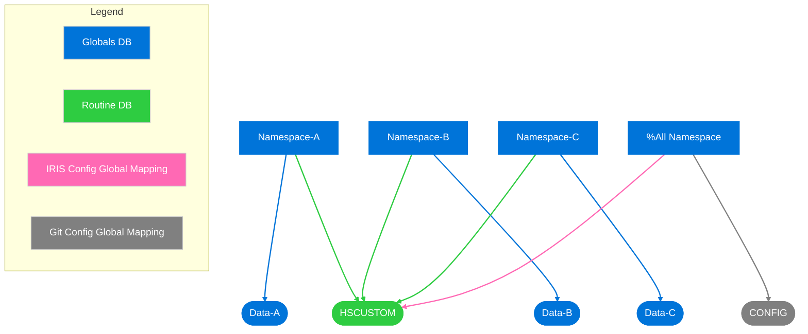

# Instance-wide Git Configuration

## Motivation
Systems on InterSystems products will often have code in multiple namespaces. This is especially true in interoperability use cases, such as IRIS for Health and HealthShare, because each namespace may only have a single running production as a time. By default, Embedded Git is isolated to a single namespace. This allows you to configure Embedded Git independently with an independent local repository for each namespace. Instead you may want to control all of the code across an IRIS instance with a single local repository. This has several benefits.
- Code reuse: shared code can be more easily reused and updated if all namespaces are sharing a single repository
- Ease of configuration in IRIS: sharing Git configuration between namespaces is easier than configuring each namespace for Git separately
- Ease of configuration in the Git remote: creating separate remote repositories in GitLab/GitHub/etc. becomes impractical when there are a large number of namespaces.

The simplest way to do this is to have all namespaces with custom code share a single routines database. The diagram below illustrates how to do this:


## Usage Notes
- Instance-wide source control is "all-or-nothing". There may not be some namespaces with shared source control configuration and other namespaces on the same instance with different source control configuration. This is because %All mappings in IRIS may not be overridden with namespace-specific mappings.
- Instance-wide configuration may not be used on TrakCare/IntelliCare instances.
- Two namespaces may not have the same interoperability production running at the same time.
- With instance-wide configuration, system default settings will be shared across all namespaces. * should not be used in system default settings unless they truly should be applied across the entire instance.

## Configuring instance-wide source control
1. Create a new database CONFIG for Embedded Git configuration.
2. Create a shared routine database for all user-defined namespaces, referred to as HSCUSTOM through the rest of this document.
3. Set HSCUSTOM as the routines database for all user-defined namespaces.
4. Create global mappings for interoperability and localization configuration to the HSCUSTOM database.
```
[Map.%ALL] 
Global_Ens.Config.Item*=HSCUSTOM 
Global_Ens.Config.Production*=HSCUSTOM 
Global_Ens.Rule=HSCUSTOM 
Global_Ens.Rule.Targets=HSCUSTOM 
Global_Ens.Config.BusinessPartner*=HSCUSTOM 
Global_Ens.Config.DefaultSettings*=HSCUSTOM 
Global_Ens.LookupTable=HSCUSTOM 
Global_Ens.Util.Schedule*=HSCUSTOM 
Global_EnsEDI.Description=HSCUSTOM 
Global_EnsEDI.Schema=HSCUSTOM 
Global_EnsEDI.X12.Description=HSCUSTOM 
Global_EnsEDI.X12.Schema=HSCUSTOM 
Global_EnsEDI.ASTM.Description=HSCUSTOM 
Global_EnsEDI.ASTM.Schema=HSCUSTOM 
Global_EnsHL7.Description=HSCUSTOM 
Global_EnsHL7.Schema=HSCUSTOM 
Global_Ens.Conf.Credentials*=HSCUSTOM 
Global_Ens.SecondaryData.Password=HSCUSTOM 
Global_IRIS.Msg=HSCUSTOM 
Global_IRIS.MsgNames=HSCUSTOM
```
5. Create global mappings for source control configuration to the CONFIG database.
```
[Map.%ALL]
Global_SYS("SourceControl")=CONFIG 
Global_SYS("SourceControlClass")=CONFIG 
Global_Studio.SourceControl*=CONFIG 
```
6. Run `##class(SourceControl.Git.API).Configure()` in one namespace to set source control configuration globals.

Steps 1, 2, 4, and 5 will be automated in the future through a new `EnableInstanceWide` method in the Embedded Git API.

## Migrating existing items into the shared routines database
If there is custom code already existing in the routines database, creating a new shared routines database will delete them. Assuming these already exist in separate Git repositories, they should all be copied into a single Git repository and imported into new database with the Import All option.